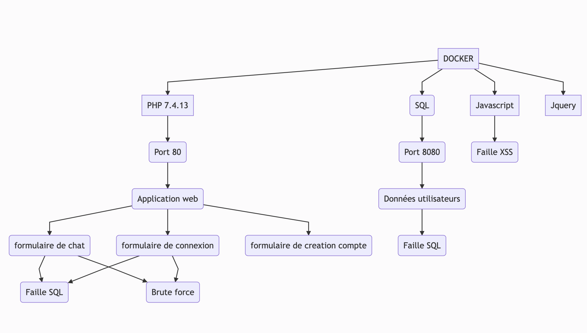
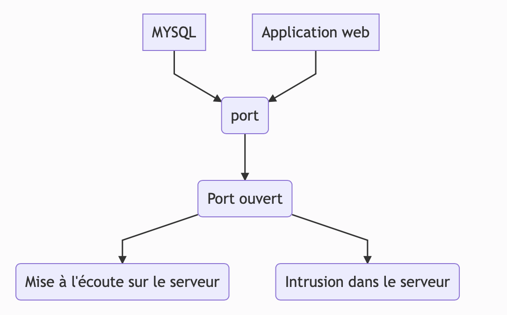

# Important
Le projet réalisé fonctionne mais apres utilisation du git pour le mettre sur mon repertoire, le projet a cessé de fonctionner. Apres de nombreuses heures de réalisations du projet et de debug, la resolution du probleme n'a pas été trouvé. Je vais faire de mon mieux afin de régler le probleme.
 **uptdate**
 Les problèmes liés aux Docker ont été resolue. Le projet peut être lancé correctement.

# Contexte

## Explications / Présentation

Ce projet entre dans le cadre du cours de **CyberSécurité** du Semestre 1 de 1ère année de Master III à l'Université Catholique de Lille, FGES.

Le sujet est le suivant : création d'un site web volontairement vulnérable (**contenant des failles de sécurité**) et analyse de sécurité / propositions pour combler ces failles. Les technologies utilisées ainsi que les fonctionnalités proposées sont libres.

## To-do

- Le projet doit pouvoir être **lancé avec une commande docker** (et donc doit avoir un Dockerfile). 
   - La commande doit apparaitre dans /README.md
- Le projet doit faire apparaitre un **dossier /tests** qui contiendra les tests unitaires qui permettraient de trouver les vulnérabilités dans votre code (vous avez carte blanche sur votre framework de test)
  - Par exemple : Un test d'injection SQL sur un paramètre GET
- Le projet doit faire un apparaitre un **dossier /exploit** qui contiendra les scripts qui permettront d'exploiter les vulnérabilités (vous avez carte blanche sur le langage du script, il faut que le script soit concis)
- Le projet doit être un **dépôt github publique**, pour que je puisse y jeter des coups d'oeil et pour les corrections
-  Le **code doit être lisible et donc correctement commenté** pour quelqu'un qui n'est pas dev (genre moi) mais qui sait lire de code (pas de "i++; // on incrémente i"). Si le code n'est pas propre et me fait perdre du temps quand je le lis, il y aura des malus.
- Le fichier README.md doit faire apparaitre les **objectifs de sécurité** de l'application :
  - Ses objectif en Confidentialité, Intégrité et Disponibilité (note /5)
- Le fichier README.md doit faire apparaitre un **graph mermaidjs** avec la surface d'attaque
- Un fichier Excel avec la même **analyse de sécurité** que le premier TP doit aussi apparaitre.

# Application de chat en ligne 

Mon application étant pas assez complet à mon gout, j'aimerais développer une application de tchat en ligne, comprenant une gestion des messages et une gestion des comptes 

# Dockerizing d'une application PHP/SQL/JS/Jquery

## Application de chat en ligne

## I-	Explication de l’application 
 L’application web est une application réalisée avec php et javascript. Elle permet, apres avoir créé un compte, d'envoyer des messages sur une messagerie commune. Plusieurs pages sont utilisées dont : 
  -	index.php : la page d’accueil du site 
  -	Connexion.php : permet à l'utilisateur de créer un compte et de se connecter
  -	Chat.php : page de chat pour envoyer des messages
  -	Connexion.vue : une page de connexion utilisateur
  -	Compte.php : permet d’afficher l'identifiant de l'utilisateur
    
  - repertoire prive: on y trouve toute les procedures d'écritures sur la bdd et les verifications des variables
  - repertoire illustration: on y trouve les images utilisées
  - repertoire decoration; on y trouve les fichiers css

### Pourquoi avoir choisis LAMP
 L'utilisation de Lamp est assez logique pour ma part car c'est ce que j'utilise le plus reguliérement mais aussi ce j'ai pu le plus approfondir en terme de sécurité.

## III- Lancer le projet à l'aide de Docker
  - Afin de lancer le projet veuillez cloner le projet sur le repertoire de votre choix:
 **git clone [lien-projet-git]**
  - Dans ce même dossier, entrer la commande suivante:
 **docker-compose build**
 **docker-compose up**
 
 **Afin de lancer le projet, veuillez avoir dockerhub lancé sur votre machine**

### A- Utilisation du projet
  Nous avons acces à differentes ressources sur le projet
  - Pour acceder à l'application web: nous y accedons en localhost
  - Pour acceder au phpmysql: nous y accedons en localhost:8080

## II-  Sécurité 

### Diagramme Mermaid : Surface d'attaque

### Les critères DICT

**Disponibilité**

Un utilisateur peut seulement interagir avec les autres à travers le chat en ligne. Mise à part cela, il n'a aucun moyen de savoir le nombre d'utilisateurs présent sur la plateforme ni leur informations. **1/5**.

**Intégrité**

Les données utilisateurs tels que le mail ou encore ne peuvent etre modifier car ces informations sont necessaire pour une connexion sur la plateforme. Les utilisateurs ont que tres peu de données sur eux meme. **4/5**.

**Confidentialité**

Le chat est un chat anonyme. Les utilisateurs utilisent un mail pour s'identifier. Ce mail doit rester confidentiel au meme niveau que le mot de passe lié à ce compte. **5/5**.

**Traçabilité**

Aucune tracabilité n'est necessaire dans cette application **1/5**.

